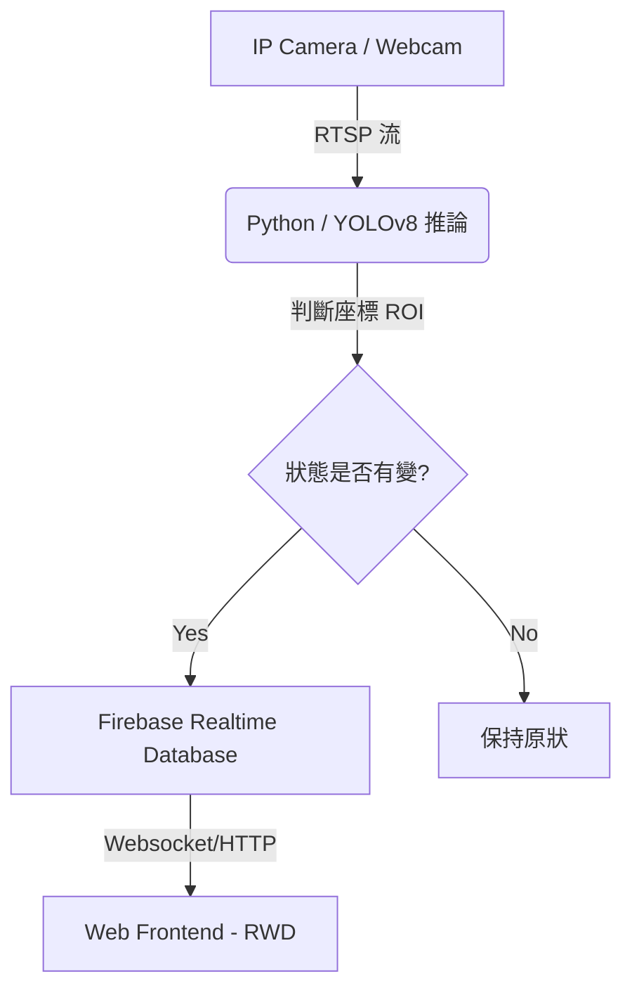

# 技術架構文件 (Technical Architecture)

## 一、 系統架構圖
本系統採用 Client-Server 架構，分為「感知端」、「雲端資料層」與「展示端」。

## 二、 技術棧 (Tech Stack)
開發語言：Python 3.10+

影像處理：OpenCV 4.x (用於影像讀取與預處理)

AI 模型：YOLOv8 (負責物件偵測：人、書包、筆電)

資料庫：Firebase Realtime Database (即時同步數據)

前端框架：Bootstrap + JavaScript (負責地圖繪製)

## 三、 核心邏輯設計：ROI 座位判定
為了在單一畫面中區分不同座位，本系統採用 ROI (Region of Interest) 座標對應法：

座標標定：在系統初始化時，手動在畫面上定義每個座位的四點座標區塊。

聯集判定 (IoU)：

當 YOLO 偵測到「人 (person)」的偵測框中心點落在「座位 A」的 ROI 內時，標記為 occupied。

若 ROI 內偵測到「背包/筆電」但無「人」，則觸發計時器，超過 15 分鐘後標記為 idling (佔位)。
## 四、 資料庫結構設計 (JSON)
{
  "stust_library": {
    "floor_3f": {
      "seats": {
        "s01": { "status": 0, "last_seen": "15:30:45" },
        "s02": { "status": 1, "last_seen": "15:28:10" }
      },
      "total_available": 15
    }
  }
}
