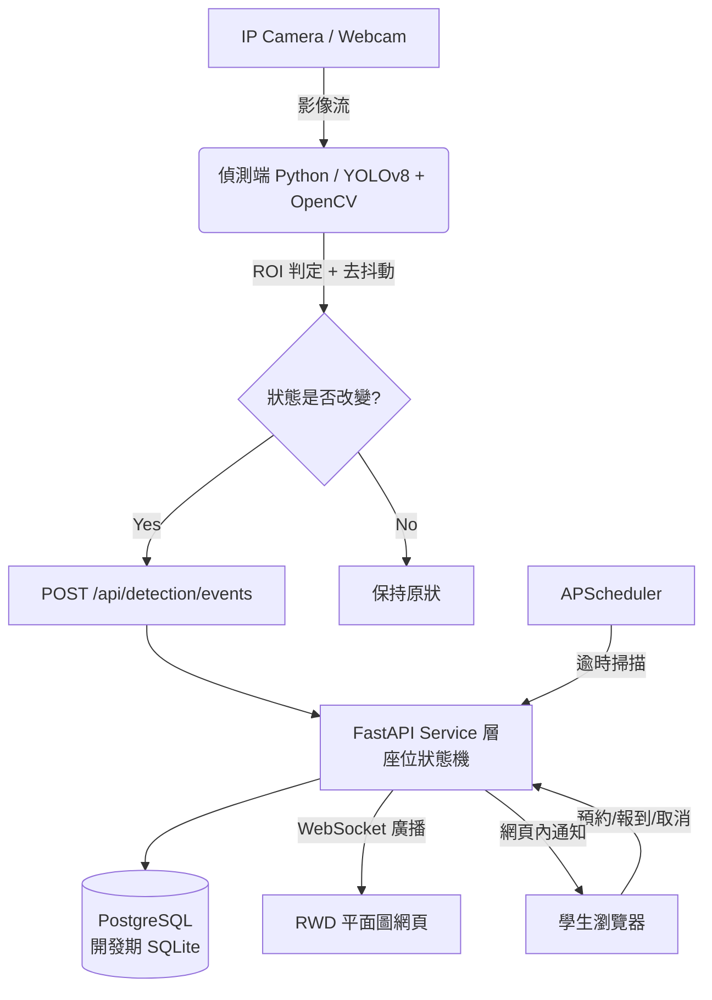

# 技術架構文件 (Technical Architecture)

## 一、 系統架構圖

本系統採 MVC 架構，分為「偵測端」、「Web 後端」與「展示端」三部分；
偵測端與後端透過 HTTP API 解耦，前端即時更新由後端 WebSocket 推播。


```mermaid
graph TD
    A[IP Camera / Webcam] -->|影像流| B(偵測端 Python / YOLOv8 + OpenCV)
    B -->|ROI 判定 + 去抖動| C{狀態是否改變?}
    C -->|Yes| D[POST /api/detection/events]
    C -->|No| E[保持原狀]
    D --> F[FastAPI Service 層<br/>座位狀態機]
    F --> G[(PostgreSQL<br/>開發期 SQLite)]
    F -->|WebSocket 廣播| H[RWD 平面圖網頁]
    I[學生瀏覽器] -->|預約/報到/取消| F
    F -->|網頁內通知| I
    J[APScheduler] -->|逾時掃描| F
```

## 二、 技術棧 (Tech Stack)

| 層 | 技術 |
|---|---|
| 開發語言 | Python 3.10+（本機 3.13） |
| Web 框架 | FastAPI + Uvicorn（Controller）、Jinja2 + Bootstrap 5（View） |
| 資料層 | SQLAlchemy 2.x ORM + Alembic migration（Model） |
| 資料庫 | PostgreSQL（開發期 SQLite，上線改 DBaaS——皆由 `DATABASE_URL` 切換） |
| 即時推播 | 原生 WebSocket（座位廣播頻道＋學號個人通知頻道） |
| 排程 | APScheduler（離席逾時／報到期限掃描，計時錨點存 DB） |
| AI 模型 | YOLOv8（偵測人、背包、筆電、書本） |
| 影像處理 | OpenCV 4.x（影像讀取、ROI 標定、畫面標記） |
| 前端圖表 | Chart.js（使用率儀表板） |

## 三、 MVC 分層

```
src/
├── main.py            # FastAPI 進入點（組裝 routers、排程、WebSocket 掛勾）
├── config.py          # 環境變數設定（DATABASE_URL、計時參數）
├── database.py        # SQLAlchemy engine / session
├── models/            # [M] ORM models
├── services/          # 業務規則：狀態機、預約、逾時、通知、報表、排程
├── controllers/       # [C] FastAPI routers：頁面、REST API、報表、WebSocket
├── views/             # [V] Jinja2 模板 + 靜態 JS/CSS
└── detection/         # 偵測端（獨立程序）：標定、偵測迴圈、去抖動、事件上報
```

## 四、 核心邏輯設計

### 4.1 座位狀態機（單一入口）

所有狀態變更（預約、偵測、逾時、管理）都經由
`SeatStateService.transition()`：驗證合法轉換 → 更新 `seats.status`
→ 寫入 `seat_status_logs` → 觸發 WebSocket 廣播。

```
AVAILABLE ──預約──▶ RESERVED ──報到(網頁/偵測)──▶ OCCUPIED
    ▲                  │逾期未報到(30分)              │離席≥15分(物品在)
    │◀─────────────────┘                             ▼
    │◀──確認逾時10分／淨空≥5分────────────────────── AWAY
    │                                  確認或本人返回 │
    └──────────────────────────────────── OCCUPIED ◀─┘
```

### 4.2 ROI 座位判定與去抖動

- **座標標定**：`src/detection/calibrate.py` 框選四點座標，經
  `PUT /api/seats/{label}/roi` 寫入 `seats.roi`。
- **判定規則**：YOLO 偵測框中心點落在 ROI 內——有「人」→ `person_present`；
  無人但有「背包/筆電/書本」→ `person_left_belongings`（疑似佔位）；
  皆無 → `seat_vacant`。
- **去抖動**：原始判定連續 5 秒一致才確認，短暫遮擋不會翻轉狀態；
  僅在確認狀態改變時上報後端，後端離線時事件入本地佇列、恢復後補送。

### 4.3 離席逾時（參數可由環境變數調整）

| 參數 | 預設 | 說明 |
|---|---|---|
| `AWAY_THRESHOLD_MINUTES` | 15 | 人離開（物品在）達此時間 → 轉 AWAY 並發網頁內通知 |
| `CONFIRM_WINDOW_MINUTES` | 10 | 通知後未按「我仍在使用」→ 釋放回 AVAILABLE |
| `CHECKIN_DEADLINE_MINUTES` | 30 | 預約後報到期限，逾期自動釋放 |
| `VACANT_THRESHOLD_MINUTES` | 5 | 人與物品皆離開達此時間 → 直接釋放 |

## 五、 資料庫結構設計

| 資料表 | 重點欄位 | 用途 |
|---|---|---|
| `seats` | label, floor, roi(JSON), map_x/y, status | 座位主檔＋目前狀態＋ROI |
| `bookings` | seat_id, student_id, checkin_deadline, checked_in_at, ended_at, end_reason | 預約生命週期 |
| `seat_status_logs` | seat_id, from/to_status, source, created_at | 全部狀態轉換歷史（報表唯一資料來源） |
| `idle_events` | seat_id, kind, away_started_at, notified_at, resolved_at, resolution | 疑似佔位／淨空事件與計時錨點 |
| `notifications` | student_id, seat_id, type, payload, read_at | 網頁內通知 |

Schema 由 Alembic 管理；遷移至 DBaaS（Supabase / Neon / RDS 等標準
PostgreSQL）時只需更換 `DATABASE_URL` 並執行 `alembic upgrade head`。

## 六、 使用率報表

- 使用率 ＝（OCCUPIED＋RESERVED＋AWAY 座位時數）÷（座位數 × 開放時數，
  預設 08:00–22:00），由 `seat_status_logs` 的狀態區間切分至小時桶計算。
- 佔位行為統計：逾時釋放次數、平均離席時長、佔位 Top 5 座位。
- 儀表板 `/admin/reports`（Chart.js），可匯出 CSV。
